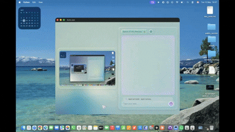

<div align="center">
  

  # Auto Use

  <a href="https://autouse.netlify.app/">
    
  </a>

  **🤖 Computer Use Framework for macOS & Windows**

  Let AI drive your computer — **Autouse AI — Computer Use**, now with both the macOS and Windows builds combined in a single repository. Control your entire OS with natural language. Browser automation, coding tasks, file management — all powered by vision-language models.

  [Features](#-features) • [Architecture](#-multi-agent-architecture) • [GUI Engine](#-how-gui-control-works) • [Example Tasks](#-example-tasks) • [Providers](#-supported-providers) • [Setup](#-setup) • [Author](#-author)
</div>

---

## ✨ Features

- **GUI automation via hybrid Accessibility + Vision** — Quartz screen capture annotated with the macOS Accessibility tree, then handed to a multimodal LLM. Not pure pixel-guessing, not pure DOM-walking — both at once.
- **Multi-agent hierarchy with unlimited spawning** — Parent → CLI Agent → parallel **Minion** scouts. No hard cap on how many sub-agents a task can fan out into.
- **Minion: read-only coding-agent explorer** — sandboxed sub-agents that `grep`, `glob`, `view`, and shell out, but can never write. Spawned in parallel, each in its own isolated session scratchpad.
- **Native AppleScript runner** — full `osascript` execution with automatic TCC permission-dialog handling so first-run consent prompts don't stall the agent.
- **Sandboxed Bash** — subprocess execution confined to a Desktop workspace, with path blocklists, 10-minute total / 15-second idle timeouts, and interactive-stdin detection.
- **Web agent** — browser automation living alongside system control, not bolted on top of it.
- **6 LLM providers** — Anthropic, Google, Groq, OpenAI, OpenRouter, Perplexity. Switch providers and models per task.

---

## 🧬 Multi-Agent Architecture

Auto Use is not one model in a loop — it's a hierarchy of agents that can spawn more agents.

```
                    ┌─────────────────────┐
                    │   Parent Agent      │
                    │  (GUI · Web · OS)   │
                    └──────────┬──────────┘
                               │ spawns
                    ┌──────────▼──────────┐
                    │     CLI Agent       │
                    │  (coding · shell)   │
                    └──────────┬──────────┘
                               │ spawns ∞
       ┌───────────────────────┼───────────────────────┐
       ▼                       ▼                       ▼
  ┌─────────┐             ┌─────────┐             ┌─────────┐
  │ Minion  │             │ Minion  │             │ Minion  │
  │  scout  │   …         │  scout  │   …         │  scout  │
  └─────────┘             └─────────┘             └─────────┘
   read-only: shell · view · grep · glob · scratchpad · exit
```

- **Parent Agent** — orchestrates GUI, web, and OS-level work. Reaches for the CLI Agent when a task needs serious code reading or writing.
- **CLI Agent** — the coding workhorse. Runs in the terminal, can read/write files, run shell commands, and spawn Minions to parallelize codebase exploration.
- **Minion** — a read-only scout sub-agent. Its action schema is restricted to `shell`, `view`, `grep`, `glob`, `scratchpad`, `exit`. No writes, no Applescript, no GUI — just fast, isolated reconnaissance. Multiple minions run in parallel; the CLI Agent waits on all of them and merges results.

Each Minion runs in its own session-isolated scratchpad at `cli_minion/{session_id}/`, with results polled from a per-run JSON file. Live progress streams to the frontend through `minion_start` / `minion_line` / `minion_end` events.

**Invocation examples:**

```bash
# Direct CLI Agent
python cli.py

# CLI Agent with a specific task
python -m Auto_Use.macOS_use.agent.cli --task "refactor the auth module"

# Single Minion for a quick read-only question
python -m Auto_Use.macOS_use.agent.cli.minions --task "where is _validate_token defined and who calls it?"
```

<div align="center">
  
</div>

---

## 🔬 How GUI Control Works

Most "AI controls your screen" projects pick one approach. Auto Use uses three, in sequence, on every loop iteration:

1. **Accessibility tree extraction** — `AXUIElementCreateSystemWide` from PyObjC's `ApplicationServices` walks the foreground window into a structured tree of buttons, text fields, links — each with coordinates, labels, and role.
2. **Annotated screenshot** — `Quartz.CGWindowListCreateImage` captures the display; PIL overlays numbered magenta bounding boxes onto every interactive element discovered in step 1. Retina / HiDPI scaling is handled automatically.
3. **Vision-model dispatch** — the annotated screenshot (JPEG-compressed, base64-encoded) plus the element tree are sent to the active multimodal LLM (Claude, GPT-4o, Gemini, …). The agent references targets by their overlay index, not by raw pixel coordinates.

**Why hybrid?** Pure-vision agents hallucinate coordinates and miss off-screen state. Pure-accessibility agents miss everything that lives in a canvas or video. Auto Use shows the model both, refreshed after every action, so it always reasons over current ground truth.

<div align="center">
  
</div>

---

## 🍎 AppleScript Engine

The AppleScript pathway is a first-class action type, not a bash escape hatch.

- Executes arbitrary `tell application "..."` blocks via `osascript`.
- **Auto-handles TCC permission dialogs** — `_click_automation_allow_button()` watches for macOS "Allow / Don't Allow" consent prompts mid-run and clicks through them so first-time automation doesn't deadlock.
- **Smart app lifecycle** — uses `open` for inactive apps, strips redundant `activate` / `launch` directives for already-running apps so foregrounding doesn't fight the user's focus.
- **30-second execution cap** with structured error reporting back to the agent.

---

## 💻 Sandboxed Bash

Shell access is wrapped in a `Sandbox` that the model can't escape by accident.

- Commands run via `subprocess.Popen` inside a designated Desktop workspace.
- **Path protection** — blocks access to `/system`, `/usr/sbin`, `/private/var`.
- **Timeouts** — 600-second total cap; 15-second idle detection so interactive prompts (Python REPL, `Enter name:`, etc.) don't hang the agent.
- **Interactive-stdin detection** — regex-matches common prompt patterns and lets the agent supply `input_text` to drive the dialog.
- **Structured returns** — `{status, output, error, agent_location}` so the agent always knows where it is in the filesystem.

---

## 🌐 Web Search

Live web search built into the agent loop — no manual copy-paste between browser and chat. Backed by Perplexity Sonar (or any Perplexity / OpenAI / Anthropic web-search-capable model when selected), the agent issues queries, reads results, and folds the findings straight into its next action.

<div align="center">
  
</div>

---

## 🎯 Example Tasks

Just describe what you want — Auto Use picks the right tool for the job.

### 🖥️ GUI Task
```
"Uninstall VLC media player"
```

### 👨‍💻 Coding Task
```
"Create a Python Flask API with user authentication"
```

### 🌐 Web Search Task
```
"Why is AMD stock price going up?"
```

### 💻 CLI Task
```
"Check disk space and clean up temp files"
```

### 🍎 AppScript Task
```
"Send an iMessage to John saying I'll be 10 minutes late"
```

---

## 🎯 What Can Auto Use Do?

| Category | Examples |
|----------|----------|
| **Browser** | Fill forms, extract data, navigate sites, download files |
| **Productivity** | Create documents, manage spreadsheets, organize files |
| **Development** | Write code, debug errors, run tests, manage git |
| **System** | Install software, configure settings, manage processes |
| **Research** | Search web, compile information, generate reports |

---

## 🧠 Supported Providers

Auto Use supports **6 LLM providers**:

- **Anthropic**
- **Google**
- **Groq**
- **OpenAI**
- **OpenRouter**
- **Perplexity**

---

## 📋 Requirements

- **macOS** (Apple Silicon or Intel) **or** **Windows 10/11**
- **API Key** from any supported provider

---

## 🚀 Setup

> 💡 **Recommended for most users:** We strongly encourage installing the **latest binary build** from our [official website](https://autouse.netlify.app/) for a fully seamless installation and the complete UI experience — no manual setup required.
>
> The steps below are for developers who want to run Auto Use directly from source.

### 🍎 macOS

1. **Run the setup script**

   ```bash
   bash MacOS_setup.sh
   ```

2. **Add your API key(s)**

   Copy the example env file and fill in your keys:

   ```bash
   cp .env.example .env
   ```

   Then open `.env` and add the API key for whichever provider(s) you want to use.

3. **Run Auto Use** — pick your experience:

   ```bash
   python app.py    # 🖼️  Full desktop UI (recommended) — webview frontend with live agent streams, minion progress, model switcher
   python main.py   # 💻  Terminal-only experience — same agents, no GUI, fully usable over SSH
   ```

### 🪟 Windows

1. **Run the setup script**

   ```bat
   windows_setup.bat
   ```

2. **Add your API key(s)**

   Copy the example env file and fill in your keys:

   ```bat
   copy .env.example .env
   ```

   Then open `.env` and add the API key for whichever provider(s) you want to use.

3. **Run Auto Use** — pick your experience:

   ```bat
   python app.py     :: 🖼️  Full desktop UI (recommended) — webview frontend with live agent streams, minion progress, model switcher
   python main.py    :: 💻  Terminal-only experience — same agents, no GUI, fully usable over SSH
   ```

> **Note:** On Windows, Python **3.13.3** is the preferred version for best compatibility.

---

## 🛡️ Safety

- **Sandbox Isolation** — Code runs in a protected environment
- **No System Modification** — Won't delete files or run destructive commands without permission
- **Permission Awareness** — Asks for confirmation before accepting elevation prompts
- **Path Protection** — Blocks access to critical system folders

---

## 🌟 Why Auto Use?

| Feature | Auto Use | Others |
|---------|----------|--------|
| Multi-agent system | ✅ | ❌ |
| Domain knowledge injection | ✅ | ❌ |
| Multi-provider LLM support | ✅ | Limited |
| Vision-based automation | ✅ | ✅ |
| Coding agent | ✅ | ❌ |
| Read-only sub-agent scouts (Minion) | ✅ | ❌ |
| Unlimited sub-agent spawning | ✅ | ❌ |
| Hybrid Accessibility + Vision GUI control | ✅ | ❌ |
| Native AppleScript with auto-consent | ✅ | ❌ |
| Web search integration | ✅ | ❌ |
| Secure sandbox | ✅ | ❌ |

---

## 💻 OS Support

This repository supports **both macOS and Windows** — the two platform builds live side-by-side in the same repo:

- **macOS** — `Auto_Use/macOS_use`
- **Windows** — `Auto_Use/windows_use`

---

## 👤 Author

**Ashish Yadav** — founder of [Autouse AI](https://github.com/auto-use)

---

## 📄 License & Attribution

Licensed under the **Apache License 2.0** — see [LICENSE](LICENSE) and [NOTICE](NOTICE).

If you use, fork, reference, or derive from this project, you must:

1. Preserve the copyright notice and the `NOTICE` file.
2. Credit **Ashish Yadav (Autouse AI)** as the original author.
3. Link back to the project: https://github.com/auto-use

### How to cite

> Yadav, Ashish. *Autouse AI — Computer Use.* Autouse AI, 2026. https://github.com/auto-use
