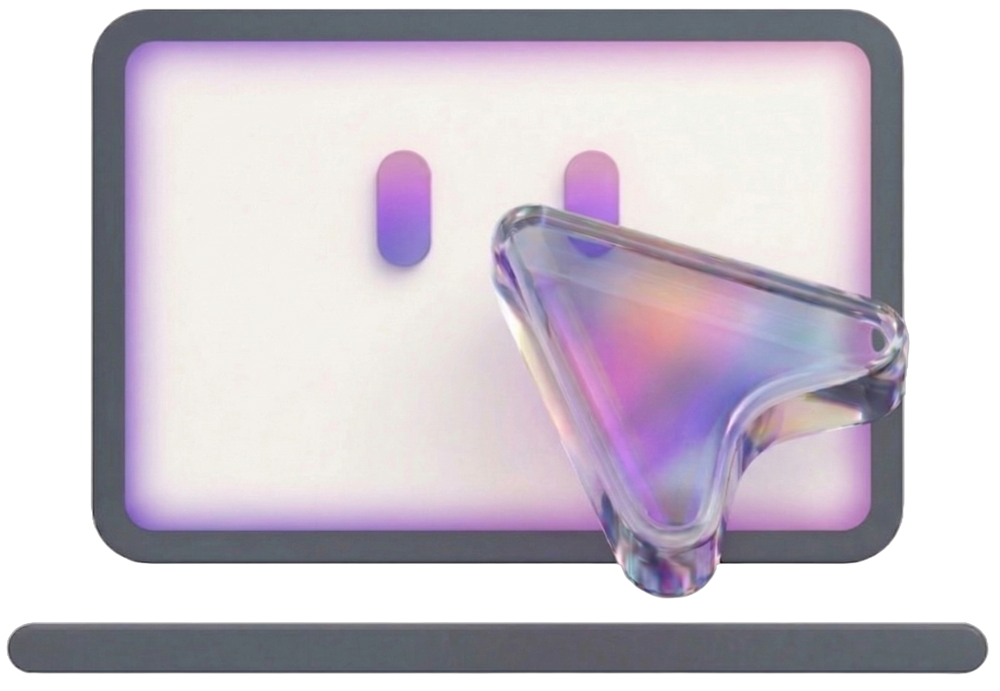

  

  # Auto Use

  **One Click. Millions of Possibilities.**

  [Features](#-features) • [Agents](#-agents) • [Models](#-supported-models) • [Requirements](#-requirements)

---

  <strong>👇 Click here to watch full video demos</strong>

  
  &nbsp;&nbsp;
  
  &nbsp;&nbsp;
  

---

## ✨ Features

### 🕷️ Undetectable Web Scraping

Scrape any website that traditional CDP-based tools can't touch. Auto Use drives a real browser through pure vision and sophisticated UI scanning — no Chrome DevTools Protocol, no debugging ports, no injected scripts. The browser runs exactly as a human would use it, making detection virtually impossible while keeping your security fully intact.

### 🔍 Human-Like Screen Perception

Auto Use sees your screen the way you do. It captures screenshots, maps the depth and layering of every window, and identifies which icons, folders, options, and text are visible — and *how much* of each is visible. This awareness lets the agent make precise, context-driven decisions about where to click, scroll, or type to complete your task.

### 🧠 Collaborative Multi-Agent Framework

Multiple specialized agents operate independently yet coordinate seamlessly when the task demands it, sharing context in real time. The framework intelligently decides which combination of agents can accomplish a task fastest: a GUI click here, a PowerShell command there, a quick web lookup in between — all orchestrated automatically.

### 📚 Adaptive Context Intelligence

Agents are environment-aware. They detect which application or workflow they're operating in and pull relevant efficiency guidelines on the fly. Inject your own expertise — whether it's app-specific shortcuts, internal processes, or operational playbooks — and the system absorbs it instantly, sharpening its behavior to make every task faster and more seamless.

### 🔒 Sandboxed Execution

The CLI agent is confined to an isolated sandbox — all coding and shell tasks run strictly inside it and cannot touch critical system paths like `C:\Windows`. Your OS stays protected while the agent builds, tests, and executes code freely within its boundaries.

### 💾 3-Stage Memory Management

A sophisticated three-stage memory system lets agents carry context well beyond a single context window. Long-running, multi-step sessions stay on track without information loss — intelligent chunking, real-time context optimization, and priority-based compression all happen seamlessly in the background with zero delay, so the agent always knows exactly where it is and what's next.

### ⚡ Kernel-Level Interaction

The GUI agent interfaces at the OS kernel level using low-level input drivers, enabling it to operate smoothly even in restricted scenarios like User Account Control (UAC) dialogs and elevated prompts that block conventional automation tools.

### 🎛️ Multi-Provider Support

Choose from 20+ AI models across OpenRouter, Groq, OpenAI, and Anthropic. Switch providers based on speed, cost, or capability needs.

---

## 🤖 What You Can Ask

Just tell Auto Use what you need — it figures out the rest.

### 🖥️ Desktop Automation
> *"Open Chrome, go to YouTube, and search for Python tutorials"*

Interacts with any Windows application through vision — clicks, types, scrolls, navigates menus, and verifies every step before moving on.

### 💻 Terminal & System Tasks
> *"Check disk space and clean up temp files"*

Executes PowerShell commands, navigates file systems, manages processes, and handles system operations — all inside a secure sandbox.

### 👨‍💻 Code Generation & Editing
> *"Create a Python Flask API with user authentication"*

Writes new files, edits existing code with precision, debugs errors, runs tests, and cleans up — without ever leaving the sandbox.

### 🌐 Real-Time Web Lookup
> *"Find the latest NVIDIA stock price and quarterly revenue"*

Searches multiple sources, extracts and summarizes data in real time, and feeds findings directly into the ongoing task.

---

## 🎯 What Can Auto Use Do?

| Category         | Examples                                                 |
| ---------------- | -------------------------------------------------------- |
| **Browser**      | Fill forms, extract data, navigate sites, download files |
| **Productivity** | Create documents, manage spreadsheets, organize files    |
| **Development**  | Write code, debug errors, run tests, manage git          |
| **System**       | Install software, configure settings, manage processes   |
| **Research**     | Search web, compile information, generate reports        |

---

## 🧠 Supported Models

Auto Use supports **20+ vision-language models** across 4 providers.

### OpenRouter

Access multiple AI providers through a single API.

| Model                    | API Name / Short Name           | Reasoning |
| ------------------------ | ------------------------------- | --------- |
| **Gemini 2.5 Pro**       | `google/gemini-2.5-pro`         | ✅         |
| **Gemini 2.5 Flash**     | `google/gemini-2.5-flash`       | ✅         |
| **Gemini 2.5 Flash Lite**| `google/gemini-2.5-flash-lite`  | ✅         |
| **Gemini 3 Pro Preview** | `google/gemini-3-pro-preview`   | ✅         |
| **Gemini 3 Flash Preview**| `google/gemini-3-flash-preview` | ✅         |
| **Gemini 3.1 Pro**       | `google/gemini-3.1-pro`         | ✅         |
| **GPT-5.1**              | `openai/gpt-5.1`                | ✅         |
| **GPT-5.2**              | `openai/gpt-5.2`                | ✅         |
| **GPT-5 Pro**            | `openai/gpt-5-pro`              | ❌         |
| **Claude Sonnet 4.5**    | `anthropic/claude-sonnet-4.5`   | ✅         |
| **Claude Sonnet 4.6**    | `anthropic/claude-sonnet-4.6`   | ✅         |
| **Grok 4 Fast**          | `x-ai/grok-4-fast`              | ✅         |
| **Grok 4.1 Fast**        | `x-ai/grok-4.1-fast`            | ✅         |
| **Kimi K2.5**            | `moonshotai/kimi-k2.5`          | ✅         |

🔗 **Get API Key:** [openrouter.ai/keys](https://openrouter.ai/keys)

---

### Groq

Ultra-fast inference with open-source models.

| Model                    | API Name / Short Name                            | Vision | Notes              |
| ------------------------ | ------------------------------------------------- | ------ | ------------------ |
| **GPT-OSS 120B**         | `openai/gpt-oss-120b`                             | —      | Coding agent only  |
| **Llama 4 Scout 17B**    | `meta-llama/llama-4-scout-17b-16e-instruct`      | ✅      |                    |

🔗 **Get API Key:** [console.groq.com/keys](https://console.groq.com/keys)

---

### OpenAI Direct

Direct access to OpenAI's latest models.

| Model       | API Name   | Reasoning |
| ----------- | ---------- | --------- |
| **GPT-5.1** | `gpt-5.1`  | ✅         |
| **GPT-5.2** | `gpt-5.2`  | ✅         |

🔗 **Get API Key:** [platform.openai.com/api-keys](https://platform.openai.com/api-keys)

---

### Anthropic Direct

Native access to Anthropic's Claude models.

| Model                  | Model name / API name   |
| ---------------------- | ----------------------- |
| **Claude Sonnet 4.6**  | `claude-sonnet-4.6` (`claude-sonnet-4-6`) |
| **Claude Sonnet 4.5**  | `claude-sonnet-4.5` (`claude-sonnet-4-5-20250929`) |
| **Claude Haiku 4.5**   | `claude-haiku-4.5` (`claude-haiku-4-5-20251001`) |
| **Claude Opus 4.5**    | `claude-opus-4.5` (`claude-opus-4-5-20251101`) |

🔗 **Get API Key:** [console.anthropic.com](https://console.anthropic.com)

---

## 🎮 Model Selection Guide

| Use Case         | Recommended Model                | Why                                   |
| ---------------- | -------------------------------- | ------------------------------------- |
| **Fast & Cheap** | `gemini-3-flash`                 | Great balance of speed and capability |
| **Most Capable** | `claude-sonnet-4.5` / `claude-4.6` / `gemini-3-pro` | Best reasoning for complex tasks      |
| **Ultra-Fast**   | `llama-4-scout` (Groq)          | Lowest latency                        |
| **Coding agent** | `gpt-oss-120b` (Groq)          | Coding agent only                     |
| **Best Vision**  | `claude-sonnet-4.5` / `claude-4.6` (Anthropic) | Excellent UI understanding   |

---

## 📋 Requirements

- **Windows 10/11** (64-bit)
- **API Key** from any supported provider

---

## 🛡️ Safety

- **Sandbox Isolation** — Code runs in a protected environment
- **No System Modification** — Won't delete files or run destructive commands without permission
- **UAC Awareness** — Asks for confirmation before accepting elevation prompts
- **Path Protection** — Blocks access to critical system folders

---

## 🌟 Why Auto Use?

| Feature                    | Auto Use | Others  |
| -------------------------- | -------- | ------- |
| Multi-agent system         | ✅        | ❌       |
| knowledge system           | ✅        | ❌       |
| 20+ model support          | ✅        | Limited |
| Vision-based automation    | ✅        | ✅       |
| Coding agent               | ✅        | ❌       |
| Web search integration     | ✅        | ❌       |
| Secure sandbox             | ✅        | ❌       |

---

## 💻 OS Support

| Operating System | Status         |
| ---------------- | -------------- |
| **Windows**      | ✅ Supported    |
| **macOS**        | 🚧 Coming Soon |
| **Linux**        | 🚧 Coming Soon |
